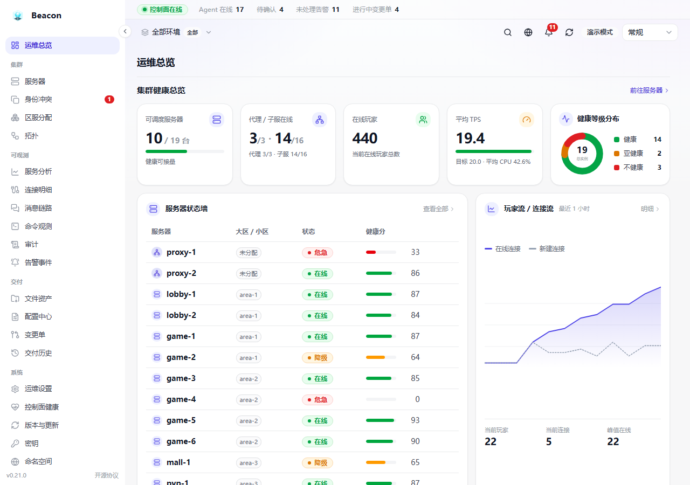
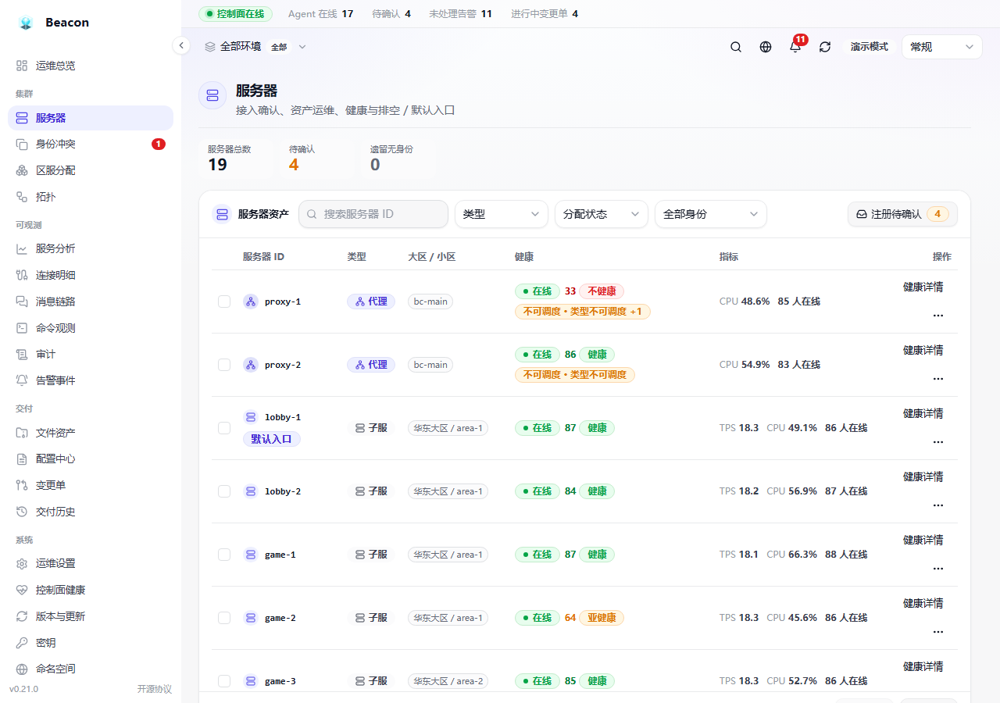
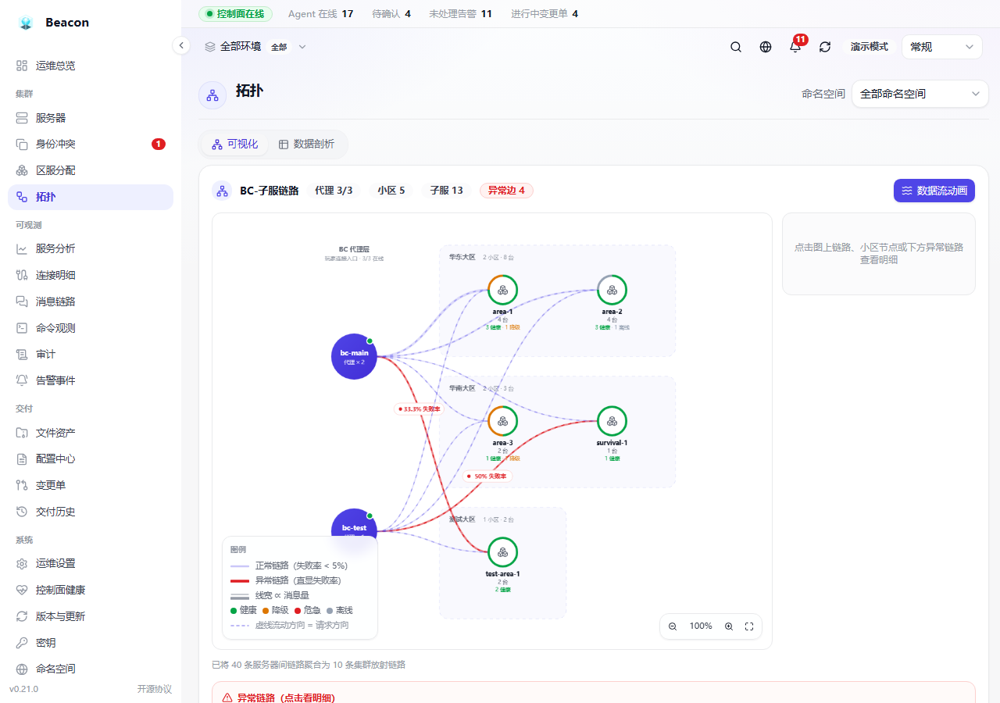
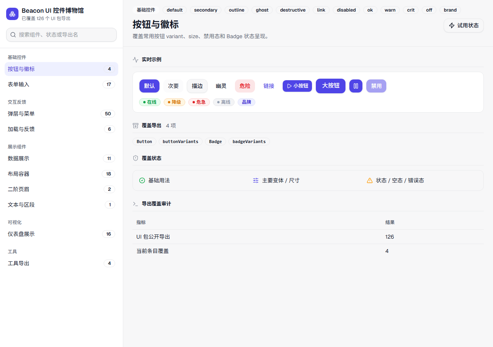

# Beacon

> 面向 Minecraft 多群组服务器的集群调度中间件控制面  
> 区服治理 · 健康调度 · 跨服消息 · 可观测审计 · 配置与交付

[](CHANGELOG.md)
[](LICENSE)
[](go.mod)
[](https://github.com/wcpe/Beacon/actions/workflows/ci.yml)

Beacon 把多个 **BungeeCord / Velocity 代理** 与 **Bukkit / Paper 子服** 串成可治理的集群：用独立 **Go 控制面**（内嵌 React 管理台，**单二进制同端口**）统一做身份绑定、区服分配、健康调度、跨服消息追踪、审计告警与灰度交付；游戏服只跑轻量 **Kotlin / TabooLib Agent**，业务插件只依赖本机 `agent-api`，禁止直连控制面。

**控制面挂 ≠ 数据面挂**：Agent 持本地快照 fail-static，控制面不可用时按快照继续跑，不阻断玩家进服。

> **发布状态**：正式 GA 以 GitHub Release **`v1.0.0`** 为准。在线更新只消费严格 `vX.Y.Z` GA。

---

## 界面预览

管理台演示模式截图（数据加载完成后）：

<p align="center">
  
  
</p>

<p align="center">
  
  
</p>

| 图 | 说明 |
|---|---|
| 运维总览 | 健康 KPI、服务器状态墙、连接流、告警与调度概览 |
| 服务器资产 | 注册待确认、身份 / 健康与资产运维 |
| 集群拓扑 | BC → 小区放射链路与异常边 |
| UI 控件博物馆 | `@beacon/ui` 控件展示，见 [docs/UI-WIKI.md](docs/UI-WIKI.md) |

```bash
# 管理台演示（免登录 + mock）
pnpm --filter @beacon/web dev

# UI 控件博物馆
pnpm --filter @beacon/ui-wiki dev
```

---

## 为什么用 Beacon

| 痛点 | Beacon 的做法 |
|------|----------------|
| 多 BC + 上百子服靠配置硬维护 | Web 管理 namespace / BC 集群 / 大区 / 小区 / 子服与默认入口 |
| 误改 serverId 导致区数据串 | 首启 `identityId` 绑定，后台确认后才可调度 |
| 业务插件直连中控难降级 | 只走本机 Agent API；中控挂了可本地快照 |
| 跨服消息、选服失败难查 | 调度决策、消息链路、连接明细与审计可追踪 |
| 插件与配置发布靠手工 | 变更单 + 流式数据面 + 灰度批次与整单回滚 |

---

## 核心能力

- **Agent 自连接与身份绑定** — 地址 / token / namespace / serverId 接入；pending → 人工确认 → active  
- **namespace 强隔离** — 默认禁止跨域调度与消息；跨域须后台显式信任并额外审计  
- **区服治理** — 环境、BC 集群、大区、小区、默认入口、排空（draining）  
- **健康调度** — TPS / CPU / 在线 / 连接 / 告警等综合评分；业务插件 `scheduling()` 取候选  
- **跨服消息** — 定向、RPC、主题广播、按玩家寻址；控制面存元数据与受控 payload（非业务库）  
- **可观测** — 运维总览、服务分析、拓扑、命令 / 审计 / 告警、连接与消息链路  
- **配置与交付 V2** — 作用域配置、文件资产、变更单灰度、热重载 / 重启生效、整单回滚  
- **热冷数据** — 近期热库；过期归档与冷查询；清理前必归档  
- **在线自更新（GA only）** — 单二进制自我替换；只发现正式 GA，不把 RC 当自动更新源  

---

## 架构一览

```
                 浏览器 ──HTTP──┐
                               ▼
   ┌──────────────────────────────────────────────┐
   │  Beacon 控制面（Go 单二进制 + 内嵌 React）       │
   │  /admin/* 管理台 API    /beacon/* agent API     │
   │  内存：在线连接 · 健康 TTL · SSE               │
   │  MySQL：身份 · 区服 · 审计 · 指标 · 归档索引    │
   └──────────────────────────────────────────────┘
        ▲ REST 注册/心跳/拉配置/上报 · SSE 推送
        │
  ┌─────┴───────┬───────────────┐
  ▼             ▼               ▼
 Agent         Agent           Agent     （Kotlin / TabooLib）
 Bukkit        Bukkit          Bungee     本地快照 fail-static
```

---

## 快速开始

### 1. 部署控制面

```bash
cp .env.example .env      # 填 MySQL、管理台账号、令牌签名密钥等
docker compose up -d      # beacon + mysql；就绪后 AutoMigrate
# 管理台与 API：http://localhost:8848
```

浏览器打开 `http://localhost:8848`，使用 `BEACON_ADMIN_USERNAME` / `BEACON_ADMIN_PASSWORD` 登录。

也可直接跑单二进制（默认 SQLite、首启释放 `config.yml`）。运维见 [docs/OPERATIONS.md](docs/OPERATIONS.md)。

### 2. 接入 Agent

将对应版本的 **BeaconAgent（Bukkit）** / **BeaconAgentProxy（Bungee）** 放入插件目录，配置控制面地址、namespace token 与 serverId。首次注册后在管理台 **服务器 → 待确认** 中确认并分配区服。

### 3. 业务插件（compileOnly）

```kotlin
repositories { mavenLocal() /* 或贵方私有仓库 */ }
dependencies {
    compileOnly("top.wcpe.beacon:beacon-agent-api:1.0.0")
    compileOnly("top.wcpe.beacon:beacon-agent-kit:1.0.0")
}
```

调度、消息、配置读取示例见 [docs/SDK.md](docs/SDK.md)。  
**运行期版本**：部署的 Agent ≥ 编译所用 api/kit 版本。

### 4. 从源码构建

```bash
make package    # 控制面单二进制（内嵌前端）+ 双端 agent jar
# 或：make web · make build · make agent
```

需要 Go 1.26+、Node + pnpm、JDK 21。

---

## 文档

面向使用与接入（不含内部需求 / 路线图 / ADR）：

| 文档 | 说明 |
|------|------|
| [docs/UI-WIKI.md](docs/UI-WIKI.md) | UI 控件博物馆：启动、覆盖率门禁、新增控件流程 |
| [docs/OPERATIONS.md](docs/OPERATIONS.md) | 部署 / 升级 / 备份 / 排障 |
| [docs/SDK.md](docs/SDK.md) | 业务插件接入 Agent API |
| [SECURITY.md](SECURITY.md) | 安全边界 |
| [CHANGELOG.md](CHANGELOG.md) | 更新日志 |

---

## 许可

[MIT License](LICENSE) · Copyright (c) wcpe
