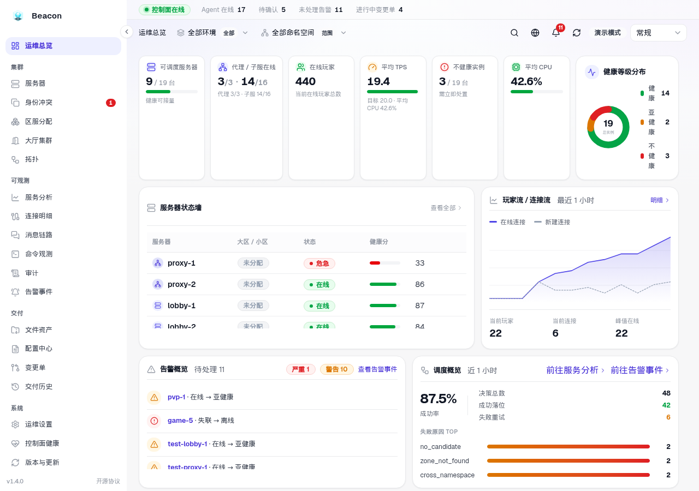
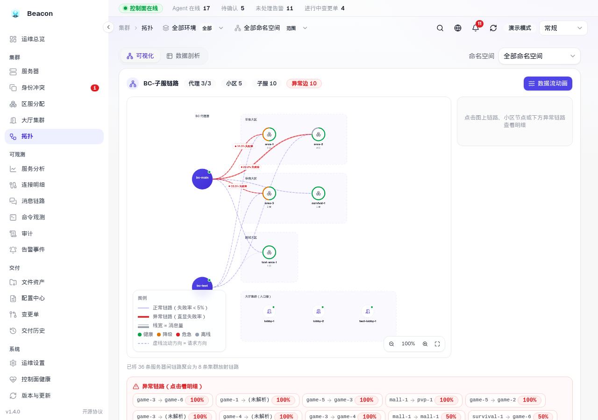
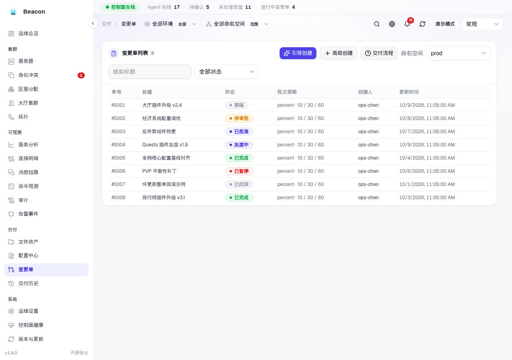
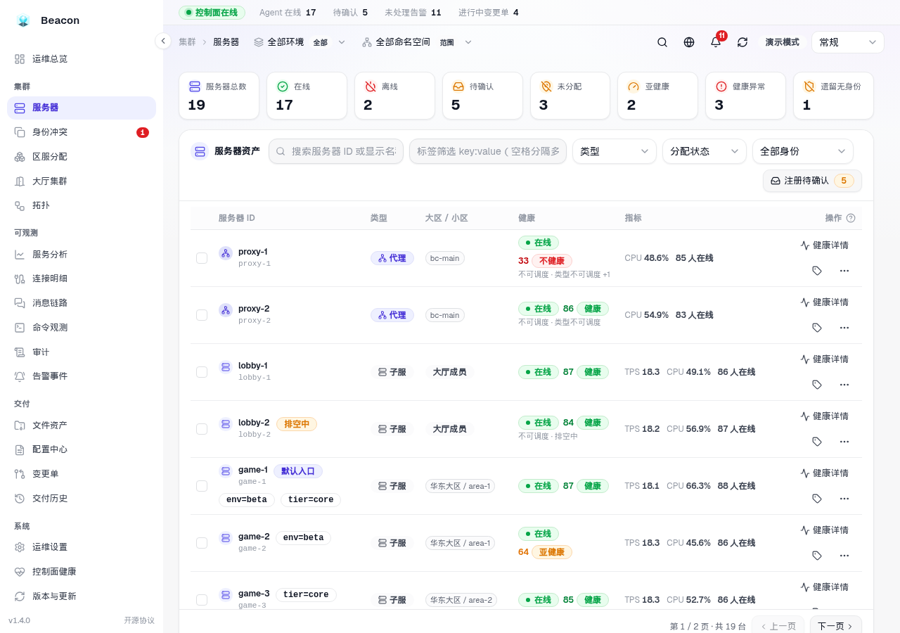

# Beacon

**面向 Minecraft 多群组服务器的集群调度中间件控制面**——给同时运维多个 BungeeCord 代理与上百台 Bukkit / Paper 子服的服主与运维团队用。

[](https://github.com/wcpe/Beacon/releases/latest)
[](https://github.com/wcpe/Beacon/releases)
[](LICENSE)
[](go.mod)
[](https://github.com/wcpe/Beacon/actions/workflows/ci.yml)
[](https://github.com/wcpe/Beacon/commits/master)
[](https://github.com/wcpe/Beacon/stargazers)
[](https://github.com/wcpe/Beacon/issues)

> **控制面挂 ≠ 数据面挂**：Agent 持本地快照 fail-static，控制面不可用时按快照继续跑，不阻断玩家进服。

- **单二进制控制面**——Go 编译产物内嵌 React 管理台，API 与管理台同端口，无需额外 Web 服务或前端部署
- **插件只连本机 Agent**——业务插件依赖 `agent-api`，不直连控制面；中控不可用时按本地快照降级
- **区服治理进后台**——namespace / BC 集群 / 大区 / 小区 / 默认入口 / 排空全部 Web 可管，不再靠配置文件硬维护
- **身份绑定防串区**——Agent 首启生成 `identityId`，后台确认后才可调度，避免误改 `serverId` 导致区数据隔离出错
- **交付可灰度可回滚**——变更单 + 分批灰度 + 热重载 / 重启生效，支持整单回滚与目标级子集回滚
- **高危操作须审批**——机器（API 密钥 / MCP）只能申请，人类批准后由持久 worker 执行并留回执

---

## 界面预览

演示模式截图（数据为示例数据）：

| 运维总览 | 集群拓扑 |
|---|---|
|  |  |
| 健康 KPI、服务器状态墙、连接流与调度概览 | BC → 小区放射链路与异常边 |

| 交付变更单 | 服务器资产 |
|---|---|
|  |  |
| 变更单分批灰度、目标级回滚与交付历史 | 注册待确认、身份 / 健康与资产运维 |

想自己点一遍管理台（免部署、免登录、mock 数据）：

```bash
pnpm install
pnpm --filter @beacon/web dev     # 浏览器打开终端提示的地址
```

---

## 快速开始

### 1. 起控制面

```bash
docker compose up -d      # 单容器 + SQLite 持久卷，API 与管理台同端口 8848
```

首次启动会在数据卷内释放 `config.yml` 并**随机生成**管理台口令。取出来用于登录：

```bash
docker compose exec beacon cat /data/config.yml    # 看 auth.username / auth.password
```

浏览器打开 `http://localhost:8848` 登录。

若要用固定凭据启动（便于自动化），把 `BEACON_ADMIN_USERNAME`、`BEACON_ADMIN_PASSWORD`、`BEACON_AUTH_SECRET` 加进 `docker-compose.yml` 的 `environment:` 段，取值参照 [.env.example](.env.example)。口令与签名密钥均为敏感项，**不要提交进仓库**。

也可以直接运行单二进制发行版（见 [Releases](https://github.com/wcpe/Beacon/releases)）：首次运行在当前目录释放 `config.yml`（含随机凭据，默认 SQLite），开箱即跑。生产若使用 MySQL，自行提供外置数据库并填写连接信息——Compose 不会创建 MySQL。

### 2. 接入 Agent

先在管理台「命名空间」创建一个 namespace，取得该 namespace 的接入 token（明文只展示一次）。

把 **BeaconAgent**（Bukkit / Paper）或 **BeaconAgentProxy**（BungeeCord）放进插件目录，只配置控制面地址与这个 token：

```yaml
beacon:
  endpoints:
    - "<CONTROL_PLANE_URL>"
  bootstrap-token: "<NAMESPACE_ACCESS_TOKEN>"
```

启动服务后，在管理台「服务器 → 待确认」核对上报身份，分配唯一 `serverId` 与拓扑归属，批准后身份由 `pending` 转为 `active`。

namespace、serverId、大区 / 小区 / 默认入口都是**控制面权威数据**，不要写回 Agent 配置。

### 3. 业务插件（compileOnly）

```kotlin
repositories {
    maven("https://repo.wcpe.top/repository/maven-public/")
}
dependencies {
    compileOnly("top.wcpe.beacon:beacon-agent-api:<GA_VERSION>")
    compileOnly("top.wcpe.beacon:beacon-agent-kit:<GA_VERSION>")
}
```

调度、消息与配置读取示例见 [docs/SDK.md](docs/SDK.md)。**运行期部署的 Agent 版本必须 ≥ 编译所用的 api / kit 版本**，否则可能出现 `NoSuchMethodError`。

### 4. 从源码构建

前置：**Go 1.26+** · **Node 22 + pnpm** · **JDK 21**。

```bash
make package    # 控制面单二进制（内嵌前端）+ 双端 agent jar → dist/
# 或分开执行：make web · make build · make agent
```

---

## 为什么用 Beacon

| 痛点 | Beacon 的做法 |
|------|----------------|
| 多 BC + 上百子服靠配置硬维护 | Web 管理 namespace / BC 集群 / 大区 / 小区 / 子服与默认入口 |
| 误改 serverId 导致区数据串 | 首启 `identityId` 绑定，后台确认后才可调度 |
| 业务插件直连中控难降级 | 只走本机 Agent API；中控挂了按本地快照 fail-static |
| 跨服消息、选服失败难查 | 调度决策、消息链路、连接明细与审计可追踪 |
| 插件与配置发布靠手工 | 变更单 + 流式数据面 + 灰度批次 + 整单 / 目标级回滚 |
| 高危操作缺少留痕 | 统一审批：机器只能申请，人类批准后由持久 worker 执行并留回执 |

---

## 核心能力

**接入与隔离**

- **Agent 自连接与身份绑定**——仅需控制面地址与 namespace token；namespace 由 token 权威推导，`pending → 人工确认 → active`
- **namespace 强隔离**——默认禁止跨域调度与消息；跨域须后台显式信任授权并额外审计
- **区服治理**——环境、BC 集群、大区、小区、默认入口与排空（draining）统一在后台维护

**调度与通信**

- **健康调度**——TPS / CPU / 在线 / 连接 / 告警等多维综合评分；业务插件经本机 `agent-api` 取候选服务器
- **跨服消息**——定向、RPC、主题广播与按玩家寻址；控制面存元数据与受控 payload（非业务库），查看正文需一次性授权

**配置与交付**

- **配置中心**——作用域配置、受管文件资产、有效配置预览与来源追溯
- **灰度交付**——变更单 + 分批灰度 + 热重载 / 重启生效；支持整单回滚与目标级（子集）回滚，配置版本回退与文件还原语义分离并在界面明示
- **在线自更新（仅 GA）**——单二进制自我替换并自带崩溃自动回滚；自动更新只消费严格 `vX.Y.Z` 正式版，RC 不进候选

**可观测与安全**

- **可观测**——运维总览、服务分析、拓扑、命令 / 审计 / 告警、连接与消息链路，并暴露 Prometheus `/metrics`
- **统一审批与受控正文**——高风险写入由审批 worker 与执行回执同事务完成；敏感配置、文件、反向抓取与命令结果使用一次性授权读取
- **资源生命周期与 MCP 自动化**——归档、恢复、墓碑化保留影响预览与审批轨迹；内置 MCP 服务以 OAuth 客户端身份、最小权限与审批交接运行

---

## 架构一览

```
                   浏览器 ──HTTP──┐
                                 ▼
   ┌────────────────────────────────────────────────────┐
   │  Beacon 控制面（Go 单二进制 + 内嵌 React 管理台）      │
   │  /admin/* 管理台与 API     /beacon/* agent API       │
   │  同端口：管理台 UI · REST · SSE · /metrics           │
   │  内存：在线连接 · 健康 TTL ；持久：SQLite / MySQL     │
   └────────────────────────────────────────────────────┘
        ▲ REST 注册 / 心跳 / 拉配置 / 上报 · SSE 推送
        │
  ┌─────┴────────┬─────────────────┐
  ▼              ▼                 ▼
 Agent          Agent             Agent        （Kotlin / TabooLib）
 Bukkit/Paper   Bukkit/Paper      BungeeCord   本地快照 fail-static
```

部署只有两层：一个控制面进程 + 若干插件 jar。**玩家流量不经控制面**，控制面短暂不可用时 Agent 按本地快照继续服务。

---

## 文档

**在线文档站**：<https://beacon.wcpe.top/>（支持中文全文搜索与版本切换）

面向使用与接入：

| 文档 | 说明 |
|------|------|
| [快速开始](https://beacon.wcpe.top/docs/wiki/quick-start) | 5 分钟跑起控制面与一台 Paper 服务 |
| [搭建集群](https://beacon.wcpe.top/docs/wiki/build-a-cluster) | BC 代理 + 大厅 + 业务小区的完整拓扑 |
| [配置与交付](https://beacon.wcpe.top/docs/wiki/configuration-and-delivery) | 配置中心、变更单、灰度与回滚 |
| [部署与运维](https://beacon.wcpe.top/docs/OPERATIONS) | 部署 / 升级 / 备份 / 排障 |
| [业务插件 SDK](https://beacon.wcpe.top/docs/SDK) | 接入 Agent API 读配置与查服务发现 |

面向二次开发的参考（含内部机制说明，仅仓库内可读）：

| 文档 | 说明 |
|------|------|
| [docs/ARCHITECTURE.md](docs/ARCHITECTURE.md) | 架构说明与边界 |
| [docs/API.md](docs/API.md) | HTTP API 参考 |
| [CHANGELOG.md](CHANGELOG.md) | 更新日志 |

---

## 贡献

欢迎提交 Issue 与 PR。动手前请先读 [docs/CONTRIBUTING.md](docs/CONTRIBUTING.md)——含分支模型、提交信息规范、质量门与发版流程。

- **缺陷与功能建议** → [Issues](https://github.com/wcpe/Beacon/issues)
- **安全漏洞** → **请勿公开开 Issue**，按 [SECURITY.md](SECURITY.md) 私下报告
- **本地验证**：构建见「快速开始 §4」；提交前请确保 `make lint` 与 `go test ./...` 全绿（CI 会跑更严格的全量门禁）
- **变更与发版**：见 [CHANGELOG.md](CHANGELOG.md)

---

## 许可

[MIT License](LICENSE) · Copyright (c) wcpe
